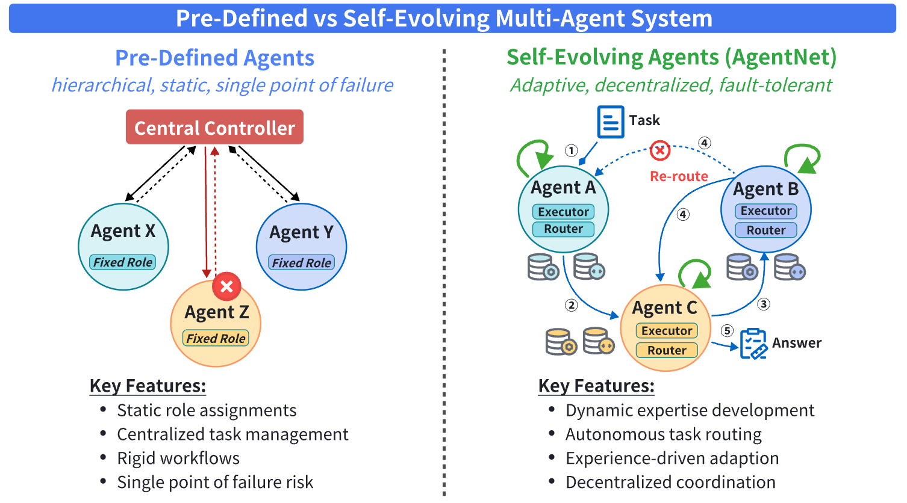

# 🌐 AgentNet: Decentralized Evolutionary Coordination for LLM-Based Multi-Agent Systems

**AgentNet** is a novel framework for building **decentralized, privacy-preserving, and adaptive multi-agent systems (MAS)** powered by large language models (LLMs). It addresses the limitations of traditional MAS architectures that rely on centralized controllers and static workflows.

> 📄 **Paper Title**: *AgentNet: Decentralized Evolutionary Coordination for LLM-Based Multi-Agent Systems*

> 👨‍🔬 Authors: Yingxuan Yang*, Huacan Chai*, Shuai Shao, Yuanyi Song, Siyuan Qi, Renting Rui, Weinan Zhang

> 🏫 Affiliation: Shanghai Jiao Tong University

> 📎 [arXiv:2504.00587](https://arxiv.org/abs/2504.00587)

---
## 🧱 AgentNet Architecture

This figure illustrates the overall architecture of AgentNet. It consists of multiple LLM-based agents connected in a dynamic, decentralized Directed Acyclic Graph (DAG). Each agent has its own retrieval-augmented memory, local routing strategy, and can evolve independently.

<p align="center">
  
</p>

---

## 🚀 Key Innovations

- **🧠 Fully Decentralized Architecture**  
  No central coordinator. Every agent makes autonomous routing and execution decisions, improving fault tolerance and enabling emergent collaboration.

- **🔀 Dynamically Evolving DAG Topology**  
  Agent connections adapt in real time based on task success metrics, forming a Directed Acyclic Graph (DAG) that optimizes collaboration.

- **📚 Retrieval-Augmented Adaptive Learning**  
  Agents store and retrieve relevant memory fragments from past tasks to refine their expertise over time, supporting continuous specialization.


---
## 🧭 Why AgentNet over Traditional Architectures?

This illustration compares conventional **Pre-Defined Multi-Agent Systems** (which are hierarchical, static, and prone to single points of failure) with **AgentNet**, which is fully decentralized, self-evolving, and dynamically specialized.

<p align="center">
  
</p>

AgentNet enables fault-tolerant collaboration and adaptive skill growth without needing predefined roles or a central controller.

---

## 🎥 Demo: Agent Collaboration, Task Processing, and Specialization in Action

The following animation provides a comprehensive demonstration of AgentNet's decentralized multi-agent coordination:
- How tasks are dynamically **routed, forwarded, split, and executed** across agents  
- How agents **adapt and evolve their capabilities** based on their past performance  
- The emergence of **specialized agent roles** over time


<p align="center">
  
</p>

📹 [Watch Full Video Demo](./Video/Recording%202025-04-22%20235246%20(online-video-cutter.com).mp4)


## 📁 Repository Structure


---

## 🛠️ Setup and Usage

Coming soon...

---

## 📌 Citation

If you use AgentNet in your research, please cite us as follows:

```bibtex
@misc{yang2025agentnetdecentralizedevolutionarycoordination,
  title={AgentNet: Decentralized Evolutionary Coordination for LLM-based Multi-Agent Systems}, 
  author={Yingxuan Yang and Huacan Chai and Shuai Shao and Yuanyi Song and Siyuan Qi and Renting Rui and Weinan Zhang},
  year={2025},
  eprint={2504.00587},
  archivePrefix={arXiv},
  primaryClass={cs.MA},
  url={https://arxiv.org/abs/2504.00587}
}

